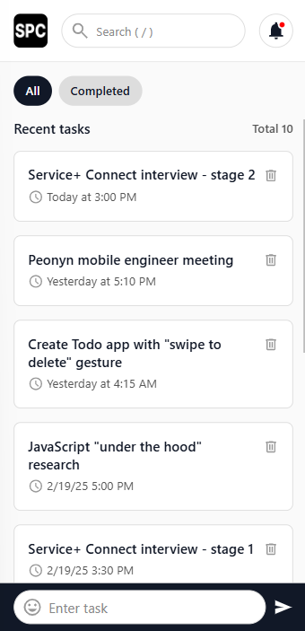

<p align="center">
  <a href="https://serviceplusconnect.com" target="blank">
    
  </a>
</p>

# ServicePlus Todo

React Native Interview | ServicePlus Connect

[](https://www.typescriptlang.org/docs/handbook/2/everyday-types.html)
[](https://reactnative.dev/docs/environment-setup)
[](https://docs.expo.dev/tutorial/create-your-first-app/)


## Setup

```bash
$ git clone https://github.com/2gbeh/service-plus-todo.git
# OR (ssh) git clone git@github.com:2gbeh/service-plus-todo.git

$ cd service-plus-todo
$ npm cache clean --force
$ npm install
# OR npm install --legacy-peer-deps

# TODO copy .env credentials

$ npx expo start -c
```

## Usage

> Local: http://localhost:8081

## Documentation

coming soon

## Screenshots


